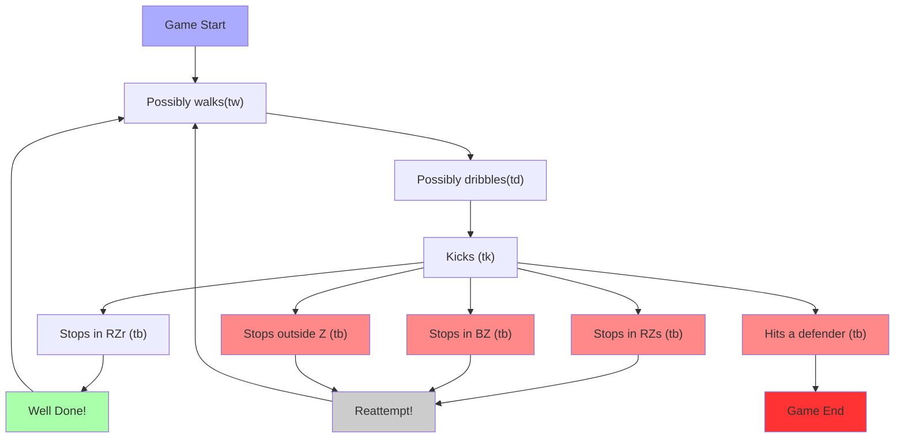

GitHub + Mermaid extension should be installed in the browser to see the diagram.

 
https://mermaid-js.github.io/mermaid-live-editor/#/edit/eyJjb2RlIjoiZ3JhcGggVEQ7XG5cbmFjdGlvbjBbXCJHYW1lIFN0YXJ0XCJdXG5hY3Rpb24xW1wiUG9zc2libHkgd2Fsa3ModHcpXCJdXG5hY3Rpb24yW1wiUG9zc2libHkgZHJpYmJsZXModGQpXCJdXG5hY3Rpb24zW1wiS2lja3MgKHRrKVwiXVxuYWN0aW9uNFtcIlN0b3BzIGluIFJaciAgKHRiKVwiXVxuYWN0aW9uNVtcIlN0b3BzIGluIFJacyAodGIpXCJdXG5hY3Rpb242W1wiU3RvcHMgaW4gQlogKHRiKVwiXVxuYWN0aW9uN1tcIlN0b3BzIG91dHNpZGUgWiAodGIpIFwiXVxuYWN0aW9uOFtcIkhpdHMgYSBkZWZlbmRlciAodGIpXCJdXG5hY3Rpb245W1wiR2FtZSBFbmRcIl1cbndlbGxkb25lW1wiV2VsbCBEb25lIVwiXVxuICAgIHJlYXR0ZW1wdFtcIlJlYXR0ZW1wdCFcIl1cbiAgICBhY3Rpb24wLS0-YWN0aW9uMTtcbiAgICBhY3Rpb24xLS0-YWN0aW9uMjtcbiAgICBhY3Rpb24yLS0-YWN0aW9uMztcbiAgICBhY3Rpb24zLS0-YWN0aW9uNDtcbiAgICBhY3Rpb24zLS0-YWN0aW9uNTtcbiAgICBhY3Rpb240LS0-d2VsbGRvbmU7XG4gICAgd2VsbGRvbmUtLT5hY3Rpb24xO1xuICAgIGFjdGlvbjMtLT5hY3Rpb242O1xuICAgIGFjdGlvbjMtLT5hY3Rpb243O1xuICAgIGFjdGlvbjMtLT5hY3Rpb244O1xuICAgIGFjdGlvbjgtLT5hY3Rpb245O1xuICAgIGFjdGlvbjUtLT5yZWF0dGVtcHQ7XG4gICAgYWN0aW9uNi0tPnJlYXR0ZW1wdDtcbiAgICBhY3Rpb243LS0-cmVhdHRlbXB0O1xuICAgIHJlYXR0ZW1wdC0tPmFjdGlvbjFcbiAgICBzdHlsZSBhY3Rpb24wIGZpbGw6I2FhZlxuICAgIHN0eWxlIHdlbGxkb25lIGZpbGw6I2FmYVxuICAgIHN0eWxlIHJlYXR0ZW1wdCBmaWxsOiNjY2NcbiAgICBzdHlsZSBhY3Rpb241IGZpbGw6I2Y4OFxuICAgIHN0eWxlIGFjdGlvbjYgZmlsbDojZjg4XG4gICAgc3R5bGUgYWN0aW9uNyBmaWxsOiNmODhcbiAgICBzdHlsZSBhY3Rpb244IGZpbGw6I2Y4OFxuICAgIHN0eWxlIGFjdGlvbjkgZmlsbDojZjMzIiwibWVybWFpZCI6eyJ0aGVtZSI6ImRlZmF1bHQiLCJ0aGVtZUNTUyI6ImRpdiB7IHRleHQtYWxpZ246IGNlbnRlcjsgZm9udC1mYW1pbHk6IHNhbnMtc2VyaWY7IH0gLmVkZ2VMYWJlbCB7IGRpc3BsYXk6YmxvY2s7IH0iLCJzZWN1cml0eUxldmVsIjoibG9vc2UifSwidXBkYXRlRWRpdG9yIjpmYWxzZX0
